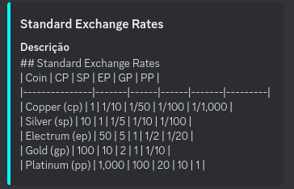
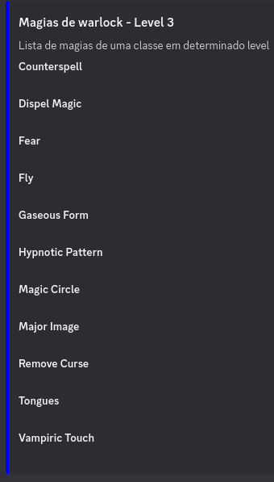
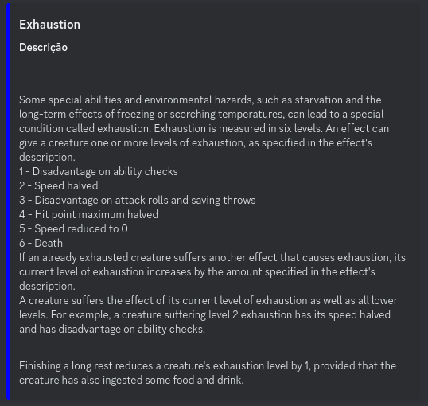
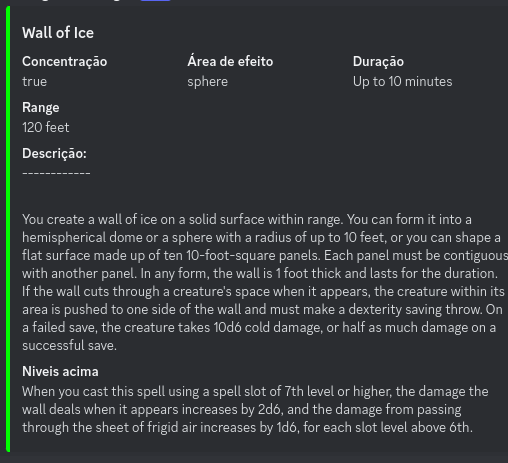

### Advogado de regra - Discord bot

Advogado de regra é um bot do discord que surgiu a partir da necessidade de verificação de algumas regras em sessões de RPG D&D 5e.
  
O bot consome da [API de D&D](https://www.dnd5eapi.co/) então tudo ainda está em inglês.

Esse projeto surgiu apenas como uma forma de solucionar uma necessidade pessoal, então irei adicionando novas features e correções de bugs a medida que forem surgindo.

Fique a vontade para usá-lo. Basta clonar o repo, criar um arquivo `config.properties` e adicionar o token (sem aspas duplas ou simples) do seu bot como consta abaixo:

Por enquanto o bot conta apenas com quatro comandos principais:

`/regras <nome_da_regra>`: Retorna alguma regra do jogo usando o nome

Exemplo:

`/magias <classe> <level>` : Retorna todas as magias de uma classe por nivel

Exemplo:

`/condicoes <nome_da_condicao>`: Retorna a condição especificada pelo nome

Exemplo:

`/magia <nome_da_magia>` : Retorna dados sobre uma magia. Como são muitas magias não tenho como colocar lista de sugestão de possiveis valores no discord (máx 25), dessa forma, caso não saiba o nome da magia, é recomendado que use o comando `/magias` para buscar uma magia especifica, copiar e colar nesse comando.

Exemplo:

